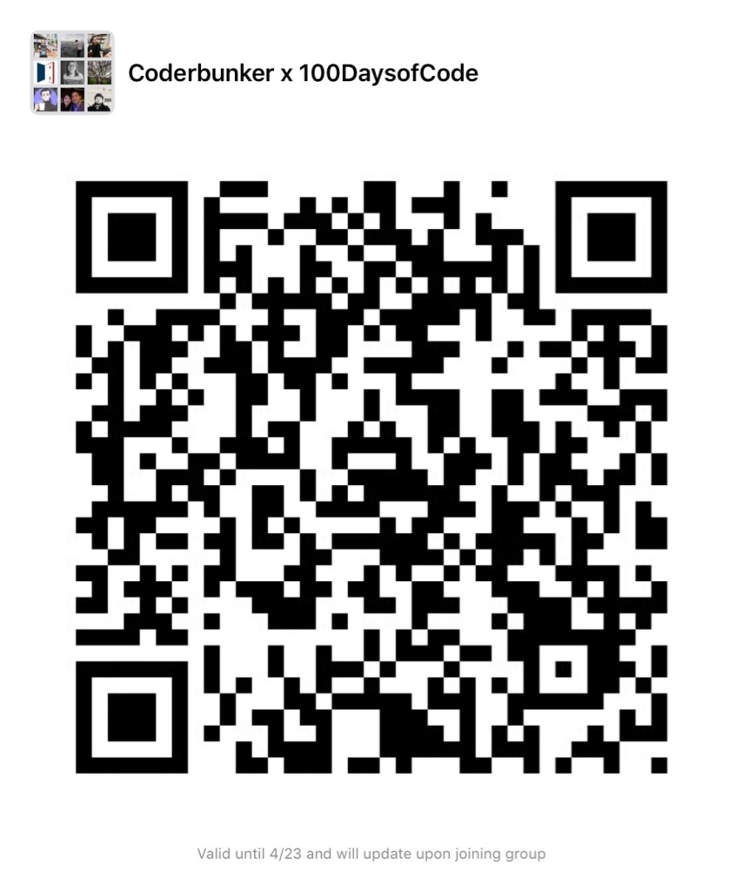

# Coderbunker x 100daysofcode
Welcome to our Coderbunker x 100 Days of Code challenge!

## Objective
To build a habit of coding by coding at least 30 minutes everyday for 100 days

## Who
Anyone in our 100 days of Code WeChat group. Scan the QR code below to join.

## Challenge dates
Monday 22nd April 2019 to Wednesday 31st July 2019

## How this works
* Code every day for 100 days
* Commit your code to Github everyday by midnight China time (GMT + 8)
* We'll track everybody's Github commits through their username everyday
* Grace days - sometimes you need a break. Every week, you get 1 free day to skip. These free days do not roll over to the next day
* At the end of our challenge (31st July 2019), whoever has the most "consistent" will be congratulated with plenty of praise and pats on the back!

### So...how do I "commit" to Github?
Great question. There's a lot of great resources and tutorials out there to learn how to use Github.
One of the better ones comes from Github labs:
https://lab.github.com/githubtraining/introduction-to-github
Please feel free to try it out to get yourself familiar with this tool!

We'll also be holding trainings as needed.

Ultimately, you'll probably want to integrate Github with the coding editor that you're using.
For example, if you're using VS Code, you can follow this tutorial to quickly sync your code changes to Github:
https://code.visualstudio.com/docs/editor/versioncontrol

## Requirements before starting
* Learn how to make a commit to Github. That is how we'll track your daily progress
* Share your Github username with the WeChat group, so we can add your name to the tracker
* Post an introduction in the group, with the following
	* What you’re working on
	* What you might need help on in the future

# Others
Any comments or questions? Let us know the WeChat group!
